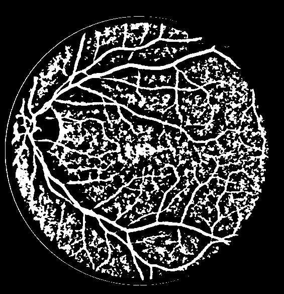
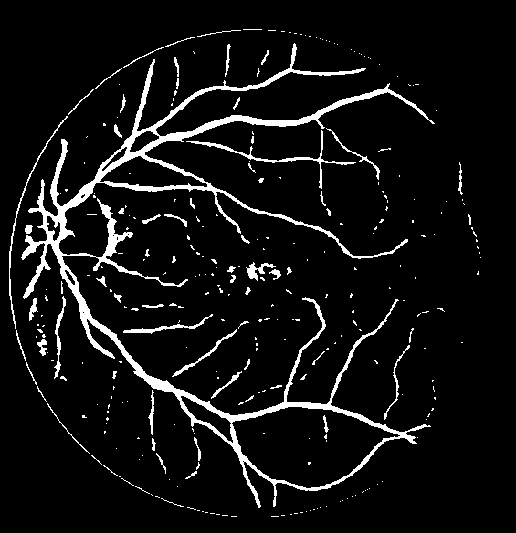

# Retinal Vessel Extraction — Sauvola vs Niblack

## Task
Extract thin vessels in fundus images using local thresholding techniques.

## Methods
Comparison between two local adaptive thresholding algorithms:
- **Niblack Thresholding**: Uses local mean and standard deviation to calculate threshold
- **Sauvola Thresholding**: A modification of Niblack that normalizes threshold, better for images with varying illumination

## Dataset
**DRIVE (Digital Retinal Images for Vessel Extraction)** - Kaggle retinal dataset mirrors

The dataset contains:
- 20 Retinal fundus images (`.tif` format)
- Manual segmentation ground truth (1st_manual)
- FOV masks

## Preprocessing
- Green channel extraction (best contrast for vessels)
- CLAHE contrast enhancement
- Gaussian smoothing (5x5 kernel)
- Field-of-view masking

## Evaluation Metrics
- **Sensitivity (Recall)**: How well methods detect vessel pixels
- **Dice Coefficient**: Overlap between prediction and ground truth
- **Jaccard Index (IoU)**: Intersection over Union

$$\text{Sensitivity} = \frac{TP}{TP + FN}$$

$$\text{Dice} = \frac{2 \times |Pred \cap GT|}{|Pred| + |GT|}$$

## Results

| Method   | Sensitivity | Dice   | Jaccard |
|----------|-------------|--------|---------|
| Niblack  | 0.8426      | 0.4727 | 0.3110  |
| Sauvola  | 0.6792      | 0.6674 | 0.5036  |

### Observations
- **Niblack** achieves higher sensitivity (0.8426) — better at detecting thin vessels
- **Sauvola** achieves better Dice (0.6674) and Jaccard (0.5036) — more balanced segmentation with fewer false positives
- Niblack is more aggressive, capturing more vessels but also more noise
- Sauvola provides cleaner results due to normalized thresholding

## Sample Results

| Original | Ground Truth | Niblack | Sauvola |
|----------|--------------|---------|---------|
|  |  |  |  |

## Learning Outcomes
- Local threshold behavior on thin structures
- Trade-off between sensitivity and precision in vessel segmentation
- Impact of normalization in adaptive thresholding (Sauvola vs Niblack)
- CLAHE preprocessing improves contrast for vessel detection

## Usage

### Requirements
```bash
pip install opencv-python numpy scikit-image
```

### Run
```bash
python main.py
```

### Output
- `result_original.png` - Original retinal image
- `result_niblack.png` - Niblack thresholding result
- `result_sauvola.png` - Sauvola thresholding result
- `result_gt.png` - Ground truth for comparison
- Console output with all metric scores

## Project Structure
```
├── main.py              # Main comparison script
├── learning.txt         # Learning notes and observations
├── training/
│   ├── images/          # Retinal fundus images
│   ├── 1st_manual/      # Ground truth vessel segmentation
│   └── mask/            # FOV masks
├── result_*.png         # Output images
├── .gitignore
└── README.md
```

## References
- DRIVE Dataset: https://www.kaggle.com/datasets/andrewmvd/drive-digital-retinal-images-for-vessel-extraction
- Niblack, W. (1986). An introduction to digital image processing
- Sauvola, J., & Pietikäinen, M. (2000). Adaptive document image binarization
